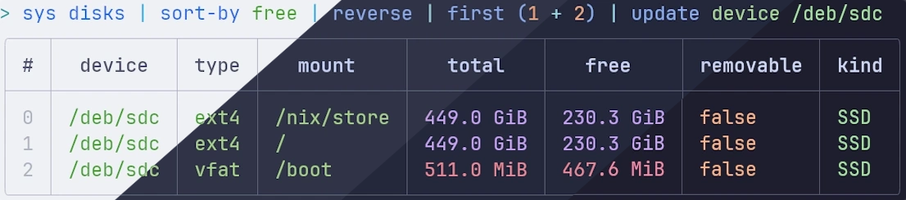
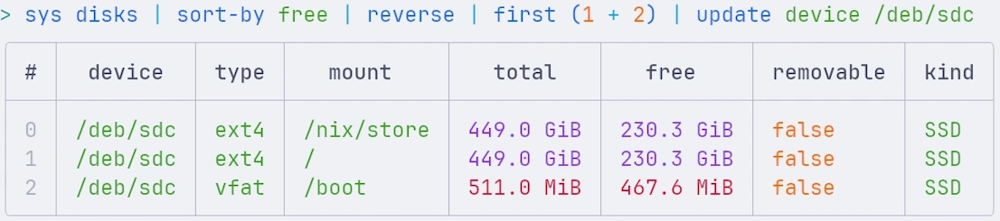
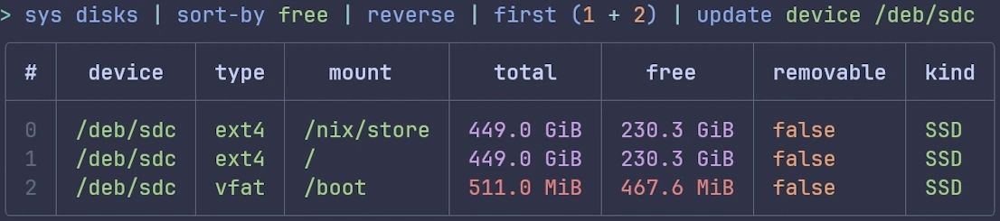
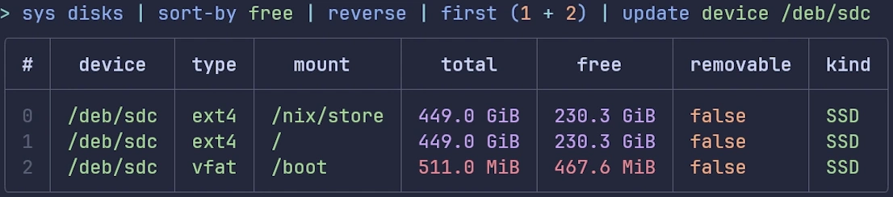
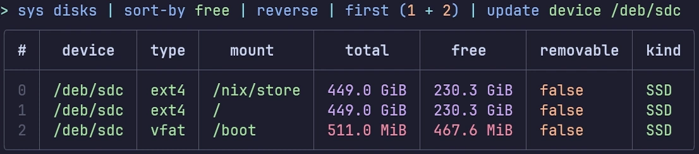

<h3 align="center">
	<br/>
	
	Catppuccin for <a href="https://nushell.sh/">Nushell</a>
	
</h3>

<p align="center">
	<a href="https://github.com/catppuccin/nushell/stargazers"></a>
	<a href="https://github.com/catppuccin/nushell/issues"></a>
	<a href="https://github.com/catppuccin/nushell/contributors"></a>
</p>

<p align="center">
	
</p>

## Previews

<details>
<summary>🌻 Latte</summary>

</details>
<details>
<summary>🪴 Frappé</summary>

</details>
<details>
<summary>🌺 Macchiato</summary>

</details>
<details>
<summary>🌿 Mocha</summary>

</details>

## Usage

Download the theme file from [the themes directory](./themes) you would like to use to your computer in the home directory, for example.

Then, depending on which theme you would like to use, add the following to your config:

```nu
source ~/catppuccin_latte.nu
```

or

```nu
source ~/catppuccin_frappe.nu
```

or

```nu
source ~/catppuccin_macchiato.nu
```

or

```nu
source ~/catppuccin_mocha.nu
```

## Building the themes

Catppuccin for Nushell uses [Whiskers](https://github.com/catppuccin/whiskers).

Modify the themes by editing [nushell.tera](./nushell.tera), then run `whiskers nushell.tera` (or `just build`).

## 💝 Thanks to

- [Nik Revenco](https://github.com/nik-rev)

&nbsp;

<p align="center">
	
</p>

<p align="center">
	Copyright &copy; 2021-present <a href="https://github.com/catppuccin" target="_blank">Catppuccin Org</a>
</p>

<p align="center">
	<a href="https://github.com/catppuccin/catppuccin/blob/main/LICENSE"></a>
</p>
